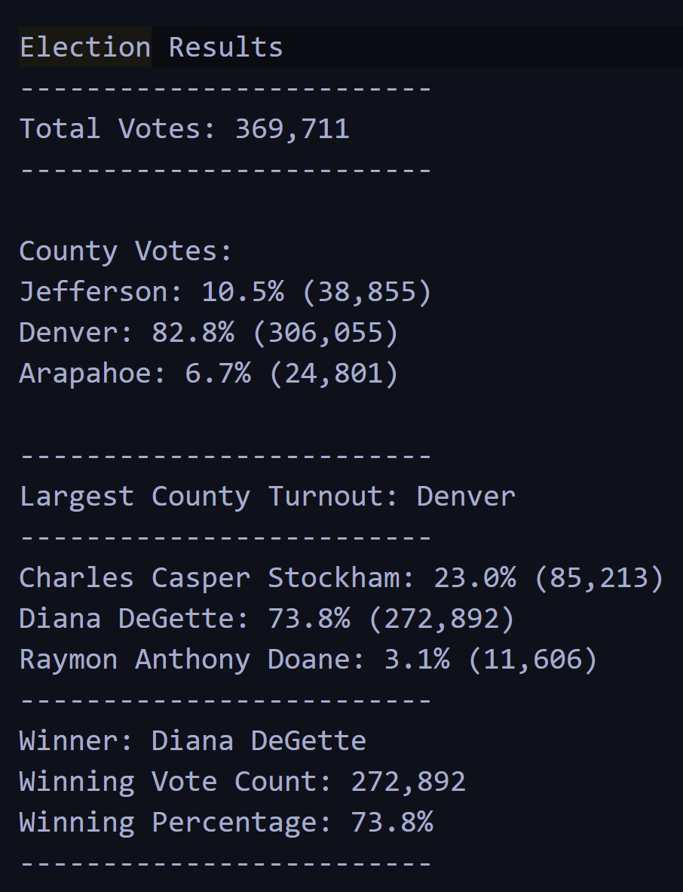

# Election_Analysis

Election Analysis to generate a vote count report to certify the US Congressional race in Colorado.

## 1. Overview of Election Audit: Explain the purpose of this election audit analysis.

Colorado Board of Elections employee Tom wants to analyze the election results in an election audit of the tabulated results for US Congressional Precinct in Colorado in order to report the total number of votes cast, total number of votes for each candidate, the percentage of votes for each candidate and the winner of the election based on the popular vote. He expects the code used for this analysis should be dynamic to be able to reuse in future for not only other congressional districts but also for senatorial districts and local elections.

There are 3 primary voting methods taken into account here and they are : Mail in Rebate, punch cards and Direct Recording Electronic machines.
Mail in ballot : are hand counted at the central office 
Punch cards : Collected and then fed into a machine that tabulates vote totals and sends the results to the central office. 
DRE : Memory Cards from DRE counting machines are sent to the central office and read by a computer. 

All the information for analysis is provided in the form of a csv file. After vote counting, we are expected to generate a vote count report to certify this US Congressional race.

## 2. Election-Audit Results: Using a bulleted list, address the following election outcomes. Use images or examples of your code as support where necessary.

### How many votes were cast in this congressional election?

#### The total votes cast in this election are 369,711.

Below is the code : 

#Add our dependencies (we added the dependencies first)
import csv
import os

#Add a variable to load a file from a path. (then we added a variable to load the respective files)
file_to_load = os.path.join("Resources", "election_results.csv")
#Add a variable to save the file to a path.
file_to_save = os.path.join("Analysis", "election_analysis.txt")

#Initialize a total vote counter (in order to get the vote count, the total_votes were initialized to 0)
total_votes = 0

### Provide a breakdown of the number of votes and the percentage of total votes for each county in the precinct.

The breakdown of the County Votes is as follows:
Jefferson: 10.5% (38,855)
Denver: 82.8% (306,055)
Arapahoe: 6.7% (24,801)

To derive the above results of the congressional race, we wrote the for loop in the following code :
#6a: Write a for loop to get the county from the county dictionary.
    for county_name in county_votes:
        # 6b: Retrieve the county vote count.
        votes = county_votes.get(county_name)
        # 6c: Calculate the percentage of votes for the county.
        vote_percentage = float(votes)/float(total_votes)*100
        county_results = (
            f"{county_name}: {vote_percentage:.1f}% ({votes:,})\n")
         # 6d: Print the county results to the terminal.
        print(county_results)
         # 6e: Save the county votes to a text file.
        txt_file.write(county_results)
         # 6f: Write an if statement to determine the winning county and get its vote count.
        if (votes > winning_county_count):
            winning_county_count = votes
            winning_county = county_name

### Which county had the largest number of votes?

Largest County Turnout: Denver 

Denver had the largest county turnout with the largest amount of votes I.e. 306,055 votes from a total of 369,711 votes with a winning percentage of 82.8%.

### Provide a breakdown of the number of votes and the percentage of the total votes each candidate received.

Charles Casper Stockham: 23.0% (85,213)
Diana DeGette: 73.8% (272,892)
Raymon Anthony Doane: 3.1% (11,606)

To derive the above results of the congressional race, we wrote the for loop in the following code :
for candidate_name in candidate_votes:

        # Retrieve vote count and percentage
        votes = candidate_votes.get(candidate_name)
        vote_percentage = float(votes) / float(total_votes) * 100
        candidate_results = (
            f"{candidate_name}: {vote_percentage:.1f}% ({votes:,})\n")

        # Print each candidate's voter count and percentage to the
        # terminal.
        print(candidate_results)
        #  Save the candidate results to our text file.
        txt_file.write(candidate_results)

        # Determine winning vote count, winning percentage, and candidate.
        if (votes > winning_count) and (vote_percentage > winning_percentage):
            winning_count = votes
            winning_candidate = candidate_name
            winning_percentage = vote_percentage

    # Print the winning candidate (to terminal)
    winning_candidate_summary = (
        f"-------------------------\n"
        f"Winner: {winning_candidate}\n"
        f"Winning Vote Count: {winning_count:,}\n"
        f"Winning Percentage: {winning_percentage:.1f}%\n"
        f"-------------------------\n")
    print(winning_candidate_summary)

### Which candidate won the election, what was their vote count, and what was their percentage of the total votes?

Winner: Diana DeGette
Winning Vote Count: 272,892
Winning Percentage: 73.8%

After considering all the votes, it was discovered that Diana DeGette won the election with as astonishing vote count of 272,892 out of 369,711 which is 73.8% total votes.

## 3. Election-Audit Summary: In a summary statement, provide a business proposal to the election commission on how this script can be used—with some modifications—for any election. Give at least two examples of how this script can be modified to be used for other elections.

The Election Analysis gave the required out put for this analysis and we were able to derive the results of this elections. It considered all the factors like the largest winning county and the winning candidate in order to be able to use these results for future. This script helps understand the counties that are ahead in their campaigns and which counties are not. Also it helps understand which candidates are getting more weightage in the elections. 

In future, this script can be modified in a lot of way :
1.	In place of county, it can be used to analyze the results of different state.
2.	And in place of county candidates, it can be modified to state or national level candidates for state or national elections.
3.	This script can also be modified for small elections in schools and corporates by modifying the variable accordingly.
4.	We can incorporate party names for the candidates in order to get more in depth knowledge about the parties preferred by the voters. This can be done by creating the party_list and party_votes dictionary.

